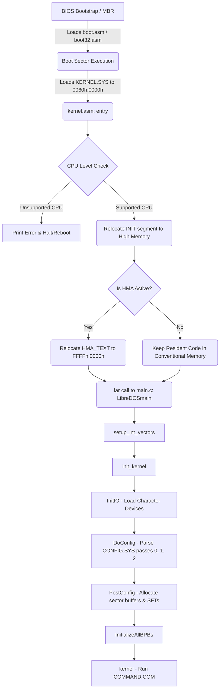
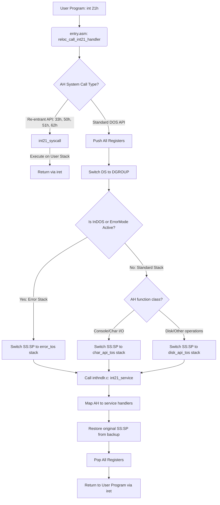
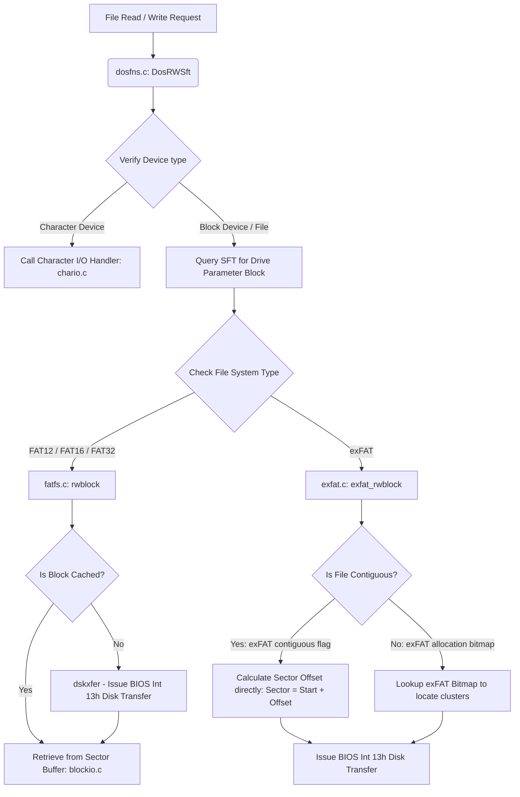
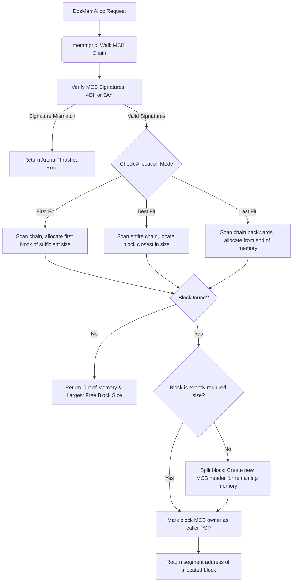

# LibreDOS Kernel Flowcharts

This document provides visual flowcharts of key execution paths within the LibreDOS kernel using Mermaid syntax.

---

## 1. Kernel Boot Phase Sequence

This diagram maps the boot phase execution flow starting from the BIOS MBR bootstrap loader through the execution of `COMMAND.COM`.

---

## 2. Int 21h System Call Handling

This diagram details the path of an `Int 21h` system call, demonstrating stack shifting, re-entrancy prevention, and execution routing.

---

## 3. FAT / exFAT File System I/O Pipeline

This diagram shows how data flows through a file read or write request and branches between standard FAT and exFAT handling.

---

## 4. Memory Manager MCB Traversal

This diagram details the memory allocation flow through Memory Control Blocks (MCBs) when a program issues an allocation request (AH=48h).

