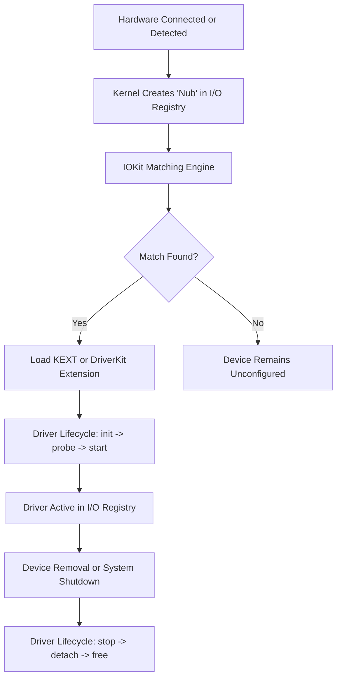
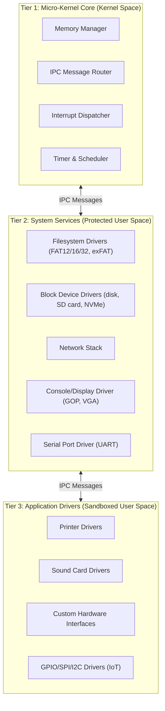
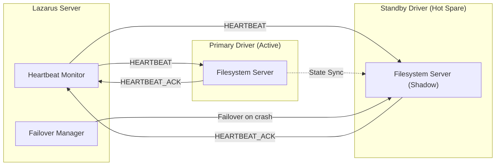
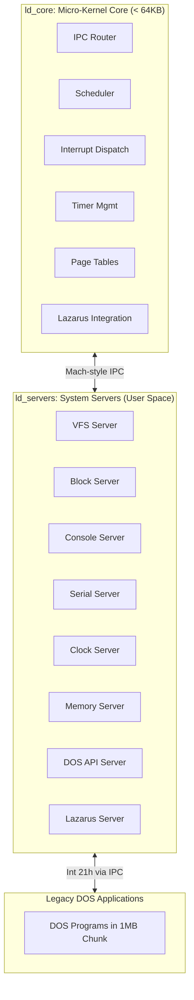
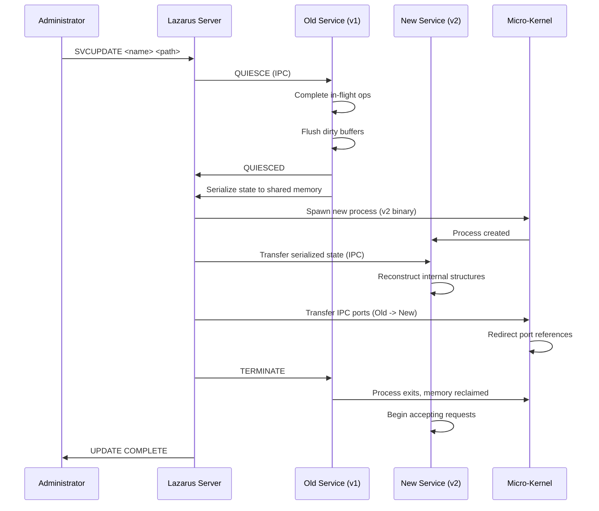
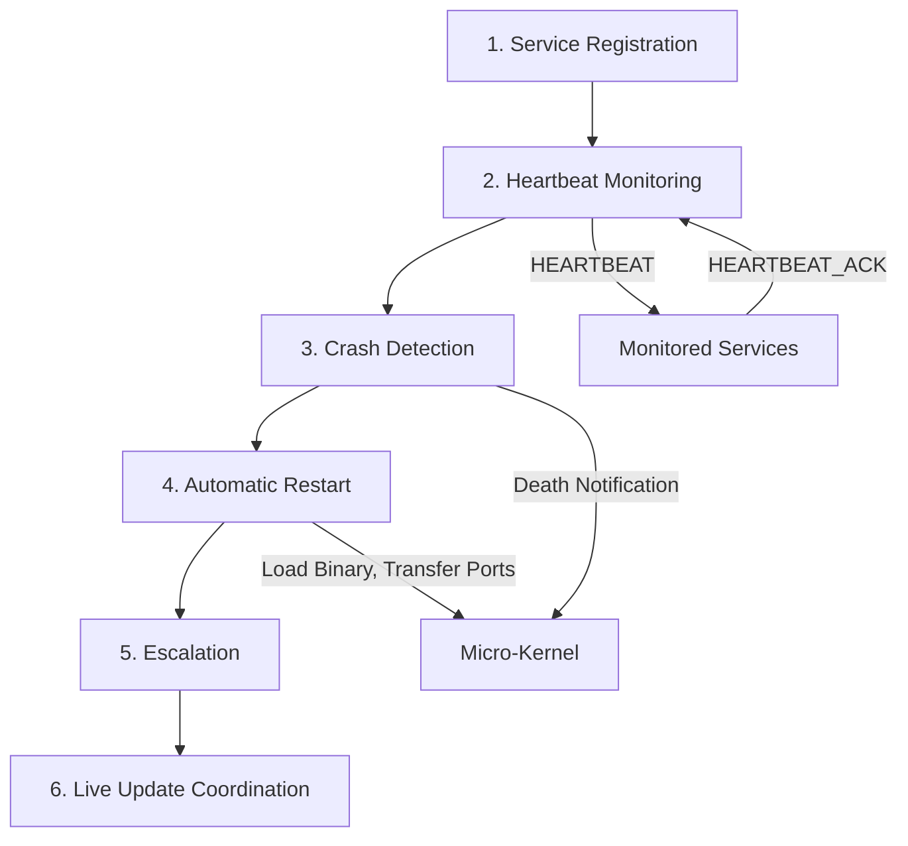
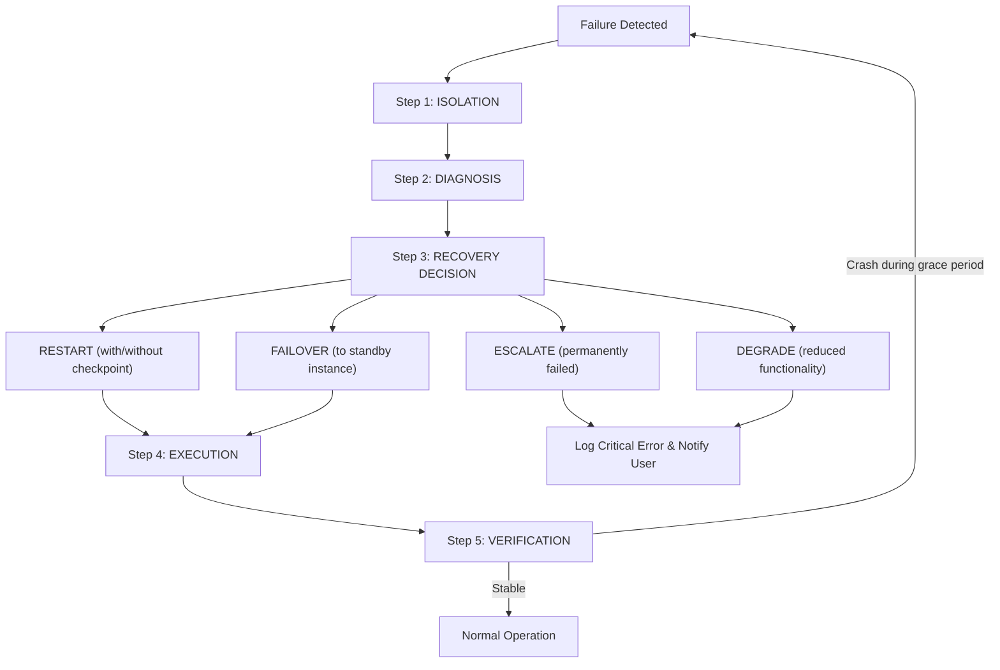
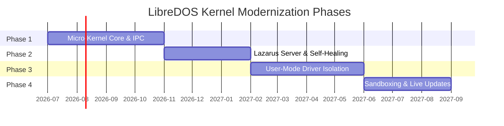

# Incorporating XNU and BSD Kernel Benefits into the LibreDOS Kernel

> A Design and Integration Reference Guide

| Field | Value |
| :--- | :--- |
| **Document Version** | 1.1 |
| **Date** | June 2026 |
| **Applies To** | LibreDOS Kernel (DOS-C / fd kernel branch) |
| **Related Documents** | [architecture.md](file:///c:/Users/rtdos/GitHub/kernel/docs/architecture.md), [kernel_architecture.md](file:///c:/Users/rtdos/GitHub/kernel/docs/kernel_architecture.md), [LMS.md](file:///c:/Users/rtdos/GitHub/kernel/docs/LMS.md), [driver_tutorial.md](file:///c:/Users/rtdos/GitHub/kernel/docs/driver_tutorial.md), [programmers_guide.md](file:///c:/Users/rtdos/GitHub/kernel/docs/programmers_guide.md), [UEIF.md](file:///c:/Users/rtdos/GitHub/kernel/docs/UEIF.md) |

---

## Table of Contents

1. [Executive Summary](#1-executive-summary)
2. [Background: XNU vs BSD vs LibreDOS Today](#2-background-xnu-vs-bsd-vs-libredos-today)
3. [Driver Loading and Management](#3-driver-loading-and-management)
   - 3.1 [How XNU Handles Drivers (IOKit and DriverKit)](#31-how-xnu-handles-drivers-iokit-and-driverkit)
   - 3.2 [How BSD Handles Drivers (Autoconfiguration)](#32-how-bsd-handles-drivers-autoconfiguration)
   - 3.3 [Proposed LibreDOS Driver Architecture](#33-proposed-libredos-driver-architecture)
   - 3.4 [Integration with Existing LibreDOS Driver Chain](#34-integration-with-existing-libredos-driver-chain)
4. [Memory Management](#4-memory-management)
   - 4.1 [XNU Mach Zone Allocator and Virtual Memory](#41-xnu-mach-zone-allocator-and-virtual-memory)
   - 4.2 [BSD Slab and UVM Allocators](#42-bsd-slab-and-uvm-allocators)
   - 4.3 [Proposed LibreDOS Memory Architecture](#43-proposed-libredos-memory-architecture)
   - 4.4 [Integration with LMS 1MB Hybrid Memory Mode](#44-integration-with-lms-1mb-hybrid-memory-mode)
5. [Redundancy and Resiliency](#5-redundancy-and-resiliency)
   - 5.1 [XNU Watchdog and Critical Process Monitoring](#51-xnu-watchdog-and-critical-process-monitoring)
   - 5.2 [BSD Jail and Process Isolation](#52-bsd-jail-and-process-isolation)
   - 5.3 [Proposed LibreDOS Redundancy Model](#53-proposed-libredos-redundancy-model)
6. [Custom Micro-Kernel Architecture](#6-custom-micro-kernel-architecture)
   - 6.1 [XNU Mach Micro-Kernel Concepts](#61-xnu-mach-micro-kernel-concepts)
   - 6.2 [QNX and MINIX Self-Healing Microkernels](#62-qnx-and-minix-self-healing-microkernels)
   - 6.3 [Proposed LibreDOS Micro-Kernel Split](#63-proposed-libredos-micro-kernel-split)
7. [Transparent Live Service Updates (No Reboot Required)](#7-transparent-live-service-updates-no-reboot-required)
   - 7.1 [How Microkernels Enable Live Updates](#71-how-microkernels-enable-live-updates)
   - 7.2 [Proposed LibreDOS Live Update Protocol](#72-proposed-libredos-live-update-protocol)
   - 7.3 [State Transfer and Quiescence](#73-state-transfer-and-quiescence)
8. [Built-In Lazarus Server (Automatic Service Restart)](#8-built-in-lazarus-server-automatic-service-restart)
   - 8.1 [macOS launchd and KeepAlive Services](#81-macos-launchd-and-keepalive-services)
   - 8.2 [MINIX 3 Reincarnation Server Model](#82-minix-3-reincarnation-server-model)
   - 8.3 [Proposed LibreDOS Lazarus Server Design](#83-proposed-libredos-lazarus-server-design)
   - 8.4 [Lazarus Policies and Health Check Protocol](#84-lazarus-policies-and-health-check-protocol)
9. [Self-Healing Subsystem](#9-self-healing-subsystem)
   - 9.1 [Failure Detection Mechanisms](#91-failure-detection-mechanisms)
   - 9.2 [Automatic Recovery Pipeline](#92-automatic-recovery-pipeline)
   - 9.3 [Integration with Lazarus Server](#93-integration-with-lazarus-server)
10. [User-Mode Isolation](#10-user-mode-isolation)
    - 10.1 [macOS DriverKit User-Space Driver Model](#101-macos-driverkit-user-space-driver-model)
    - 10.2 [BSD Process Separation and kqueue Monitoring](#102-bsd-process-separation-and-kqueue-monitoring)
    - 10.3 [Proposed LibreDOS User-Mode Driver Framework](#103-proposed-libredos-user-mode-driver-framework)
    - 10.4 [IPC Message-Passing Channel Design](#104-ipc-message-passing-channel-design)
11. [Sandboxing](#11-sandboxing)
    - 11.1 [macOS App Sandbox and System Integrity Protection](#111-macos-app-sandbox-and-system-integrity-protection)
    - 11.2 [FreeBSD Capsicum Capability-Based Sandboxing](#112-freebsd-capsicum-capability-based-sandboxing)
    - 11.3 [OpenBSD pledge System Call Restriction](#113-openbsd-pledge-system-call-restriction)
    - 11.4 [Proposed LibreDOS Sandbox Architecture](#114-proposed-libredos-sandbox-architecture)
12. [Implementation Roadmap](#12-implementation-roadmap)
13. [Mapping to Existing LibreDOS Source Files](#13-mapping-to-existing-libredos-source-files)
14. [Architectural Maintenance Guidelines](#14-architectural-maintenance-guidelines)
15. [References and Further Reading](#15-references-and-further-reading)

---

## 1. Executive Summary

This document describes how the LibreDOS kernel can adopt proven techniques from the **macOS XNU kernel** (which combines a Mach micro-kernel core with a BSD Unix personality layer and the IOKit/DriverKit driver framework) and from standalone **BSD kernels** (FreeBSD, NetBSD, OpenBSD) to achieve:

- **Robust, hot-swappable driver loading** with user-mode isolation
- **Advanced memory management** with zone-based and slab allocators
- **Built-in redundancy** through process duplication and failover
- **System resiliency** via watchdog monitoring and automatic recovery
- **A clean micro-kernel / service split** for embedded and IoT targets
- **Transparent live updates** of system services without rebooting
- **A "Lazarus Server"** that automatically restarts failed drivers and services
- **Self-healing capabilities** that detect, isolate, and repair faults
- **User-mode driver isolation** to prevent kernel crashes from driver bugs
- **Sandboxing** to confine processes to minimum necessary privileges

> [!IMPORTANT]
> All proposed changes maintain **100% backward compatibility** with the existing MS-DOS/PC-DOS application interface (`Int 21h`, `Int 2Fh`, `Int 25h/26h`) and preserve the **LibreDOS Memory Specification (LMS) 1MB Hybrid Memory Mode**.

---

## 2. Background: XNU vs BSD vs LibreDOS Today

### XNU (X is Not Unix)

The macOS/iOS kernel is a **hybrid design** combining three components:

| Component | Role | Key Responsibilities |
| :--- | :--- | :--- |
| **Mach Micro-Kernel Core** | Low-level foundation | Virtual memory management, thread scheduling, inter-process communication (IPC) via Mach ports and messages |
| **BSD Unix Personality Layer** | POSIX-compliant environment | Process management (PIDs, signals), filesystem abstractions (APFS, HFS+), networking (TCP/IP sockets), Unix security model (users, groups, permissions) |
| **IOKit / DriverKit Framework** | Hardware management | IOKit: object-oriented C++ framework for kernel-mode drivers. DriverKit: moves drivers to user space for stability and security |

### BSD Kernels (FreeBSD, NetBSD, OpenBSD)

Traditional monolithic Unix kernels with strong security features:

| Feature | System | Description |
| :--- | :--- | :--- |
| **Capsicum** | FreeBSD | Capability-based sandboxing using file descriptors |
| **pledge()** | OpenBSD | Restricts process system call surface |
| **kqueue** | All BSDs | Scalable kernel event notification for process monitoring |
| **Jails** | FreeBSD | Lightweight OS-level virtualization containers |
| **UVM** | NetBSD/OpenBSD | Unified virtual memory system |

### LibreDOS Today

The LibreDOS kernel is a monolithic DOS-compatible kernel descended from DOS-C. The existing architecture includes:

- Legacy driver chain (`LoL->nul_dev` linked list of device headers)
- Trampoline wrappers for routing legacy calls to high-memory drivers
- LMS 1MB Hybrid Memory Mode with `dos_chunk_t` isolation
- Dynamic Physical Allocator (page pager, slab allocator, chunk pager)
- BSD-inspired driver registration (`probe`/`attach`/`detach`/`read`/`write`/`ioctl`)
- UEFI and IoT platform support (GOP framebuffer, GPIO/SPI/I2C/UART)

> [!NOTE]
> The goal of this document is to extend this foundation with XNU and BSD techniques to create a resilient, self-healing, modular operating system while preserving full legacy compatibility.

---

## 3. Driver Loading and Management

### 3.1 How XNU Handles Drivers (IOKit and DriverKit)

In macOS, driver loading follows this sequence:



1. **Device Discovery** — When hardware is connected or detected at boot, the kernel creates a "nub" object representing the device in the device tree (the I/O Registry).
2. **Matching** — The IOKit framework compares device properties (vendor ID, product ID, class codes) against property tables declared in available Kernel Extensions (KEXTs) or DriverKit extensions.
3. **Loading** — When a match is found, the matching driver binary is loaded. With DriverKit, loading occurs in a separate user-space process rather than inside the kernel address space.
4. **Lifecycle Management** — Drivers follow `init` → `probe` → `start` → `stop` lifecycle methods. The framework manages power state transitions, device removal events, and driver unloading.
5. **I/O Registry** — A live, queryable database tracks all device relationships, states, and driver bindings at runtime.

> [!TIP]
> **Key Benefit:** If a DriverKit (user-space) driver crashes, it can be restarted without affecting the kernel or other drivers.

### 3.2 How BSD Handles Drivers (Autoconfiguration)

BSD kernels use an autoconfiguration ("autoconf") system:

1. **Bus Probing** — During boot, the kernel walks the hardware bus hierarchy (PCI, ISA, USB, etc.) and calls `probe()` on each registered driver to check for matching hardware.
2. **Attachment** — When `probe()` succeeds, the kernel calls `attach()` to initialize the driver and bind it to the device instance.
3. **Detachment** — The kernel calls `detach()` when the device is removed or the driver is being unloaded.
4. **Device Switch Table** — Block and character devices are registered in `bdevsw[]` and `cdevsw[]` arrays, indexed by major device number.

> [!TIP]
> **Key Benefit:** Clean separation between probing and attachment allows dynamic driver loading without fixed compile-time device tables.

### 3.3 Proposed LibreDOS Driver Architecture

We propose a **three-tier driver loading model** that combines XNU and BSD approaches:



#### Tier 1: Micro-Kernel Core Drivers (Kernel Space)

Minimal set of drivers compiled directly into the kernel binary. These are trusted, essential services that must never be unloaded:

- Memory manager (page allocator, slab allocator)
- IPC message router (Mach-style port/message passing)
- Interrupt dispatcher
- Timer and scheduler

#### Tier 2: System Service Drivers (Protected User Space)

Drivers that run as isolated user-mode processes, communicating with the micro-kernel via IPC messages:

- Filesystem drivers (FAT12/16/32, exFAT)
- Block device drivers (disk, SD card, NVMe)
- Network stack (if/when implemented)
- Console/display driver (GOP framebuffer, VGA text)
- Serial port driver (UART)

These drivers are loaded dynamically and can be **stopped, updated, and restarted without rebooting the system**.

#### Tier 3: Application Drivers (Sandboxed User Space)

Third-party or optional drivers loaded on demand via `CONFIG.SYS` `DEVICE=` statements or at runtime via a new `LOAD` command:

- Printer drivers
- Sound card drivers
- Custom hardware interfaces
- GPIO/SPI/I2C drivers for IoT platforms

These run in sandboxed processes with restricted privileges.

### 3.4 Integration with Existing LibreDOS Driver Chain

The existing DOS device driver chain (`LoL->nul_dev` linked list) and the BSD-inspired driver registration interface (`struct driver` with `probe`/`attach`/`detach`/`read`/`write`/`ioctl`) are preserved as the public API.

The trampoline device wrapper mechanism documented in [driver_tutorial.md](file:///c:/Users/rtdos/GitHub/kernel/docs/driver_tutorial.md) continues to function: a 32-byte stub in conventional memory (below 640KB) intercepts legacy Strategy/Interrupt calls and routes them through IPC to the appropriate Tier 2 or Tier 3 user-space driver.

**New additions:**

- **Device Registry** (inspired by IOKit's I/O Registry) — maintains a runtime database of all loaded drivers, their states, and their device bindings.
- **Matching Engine** — compares bus-probed device descriptors (PCI vendor/device IDs, USB class codes, UEFI device paths) against driver manifest files to auto-load the correct driver.
- **Driver Lifecycle Manager** — tracks each driver's state through the transition pipeline and coordinates with the Lazarus Server for restarts:

```
LOADED -> PROBING -> ATTACHED -> RUNNING -> STOPPING -> DETACHED
```

---

## 4. Memory Management

### 4.1 XNU Mach Zone Allocator and Virtual Memory

The XNU kernel uses the Mach Virtual Memory (VM) system:

- **Virtual Address Spaces** — Each process gets an isolated virtual address space managed by `vm_map` structures (collections of `vm_map_entry` records describing mapped regions).
- **Zone Allocator** — A high-speed kernel allocator for fixed-size objects (thread control blocks, VM map entries, IPC port structures). Zones group same-sized objects contiguously to minimize fragmentation and maximize cache locality.
- **Purgeable Memory** — Memory pages that can be reclaimed by the kernel under pressure, without terminating the owning process.
- **Memory Pressure Notifications** — Processes can register for memory-pressure callbacks and voluntarily release caches.

> [!TIP]
> **Key Benefit:** Zone allocator eliminates fragmentation for high-frequency kernel allocations; purgeable memory gracefully handles low-memory conditions without forced process termination.

### 4.2 BSD Slab and UVM Allocators

BSD kernels provide alternative memory management approaches:

| Allocator | System | Description |
| :--- | :--- | :--- |
| **Slab Allocator** | FreeBSD | Pre-allocates pools of same-sized objects (similar to Mach zones). Used for network buffers (mbufs), vnodes, and file descriptor tables. |
| **UVM** | NetBSD/OpenBSD | Unified Virtual Memory system that replaced Mach VM. Uses a simplified pager model with anonymous memory objects and shared file mappings. |
| **UMA** | FreeBSD | Universal Memory Allocator combining slab allocation with per-CPU caching for scalable SMP performance. |

> [!TIP]
> **Key Benefit:** Per-CPU caching (UMA) eliminates lock contention on multi-processor systems.

### 4.3 Proposed LibreDOS Memory Architecture

LibreDOS already implements a Dynamic Physical Allocator (DLA) with a page pager, slab allocator, and chunk pager (documented in [LMS.md](file:///c:/Users/rtdos/GitHub/kernel/docs/LMS.md) and [architecture.md](file:///c:/Users/rtdos/GitHub/kernel/docs/architecture.md)). We extend this with XNU/BSD concepts:

#### Zone Allocator (NEW — inspired by Mach zones)

Create named memory zones for high-frequency kernel objects:

```c
/* Named zone definitions for kernel object pools */
ld_zone_t *ld_zone_sft;       /* System File Table entries (struct sft)  */
ld_zone_t *ld_zone_cds;       /* Current Directory Structures (struct cds) */
ld_zone_t *ld_zone_mcb;       /* Memory Control Blocks                  */
ld_zone_t *ld_zone_dpb;       /* Drive Parameter Blocks (struct dpb)    */
ld_zone_t *ld_zone_ipc;       /* IPC message buffers                    */
ld_zone_t *ld_zone_driver;    /* Driver descriptor structures           */
ld_zone_t *ld_zone_lazarus;   /* Lazarus health-check context blocks    */
```

Each zone pre-allocates a pool of same-sized objects. Allocations within a zone are **O(1)** — simply pop from the free list. Deallocations push back onto the free list. When a zone's pool is exhausted, the page pager allocates a new 4KB page and carves it into zone objects.

#### Purgeable Memory Support (NEW — inspired by XNU)

Extend the `dos_chunk_t` context with a purgeable page list. When the system runs low on physical pages, the page pager can reclaim purgeable pages without terminating the owning process. This is particularly useful for disk cache buffers ([blockio.c](file:///c:/Users/rtdos/GitHub/kernel/kernel/blockio.c)) that can be regenerated from disk reads.

#### Memory Pressure Callbacks (NEW — inspired by XNU)

Tier 2 and Tier 3 drivers can register memory-pressure callback functions. When the page pager detects that free pages have dropped below a configurable threshold, it invokes these callbacks so that drivers can voluntarily release cached data.

### 4.4 Integration with LMS 1MB Hybrid Memory Mode

All zone allocator and purgeable memory features operate within the existing LMS framework:

- Zone pools for **legacy structures** (SFT, CDS, MCB) reside within the Chunk 0 conventional memory space (0–640KB) or in the High Memory Area (HMA) to preserve segment-offset compatibility.
- Zone pools for **modern structures** (IPC buffers, driver descriptors, Lazarus contexts) are allocated from the flat 64-bit host RAM pool outside the 1MB boundary.
- The `ld_translate_address()` function continues to handle all segment:offset to flat address conversions. Zone allocations do **not** modify the translation logic.
- Existing slab allocator constants in [LMS.md](file:///c:/Users/rtdos/GitHub/kernel/docs/LMS.md) Section 3 may be tuned to reflect the new zone-based pools. This is permitted under the "What We Can Change" guidelines.

> [!WARNING]
> The 1MB Hybrid Memory Mode boundary translation math in `ld_translate_address()` and the strict `CHUNK_SIZE_1MB` constant are **immutable**. Changing these will corrupt legacy segment address mappings.

---

## 5. Redundancy and Resiliency

### 5.1 XNU Watchdog and Critical Process Monitoring

macOS uses two layers of supervision:

| Component | Scope | Behavior |
| :--- | :--- | :--- |
| **launchd** (PID 1) | User-space services | Services configured with `KeepAlive=true` are automatically restarted when they crash or exit. |
| **watchdogd** | Critical system processes | Monitors processes like `WindowServer` and `logd`. If a monitored process fails to check in within a deadline, triggers a kernel panic to force a clean reboot. |

> [!TIP]
> **Key Benefit:** Two-tier monitoring ensures both user-space services and critical system processes are supervised.

### 5.2 BSD Jail and Process Isolation

FreeBSD jails provide lightweight virtualization:

- Each jail is an isolated environment with its own root filesystem, process space, network interfaces, and user accounts.
- Processes inside a jail cannot see or signal processes outside it.
- Failed services inside a jail do not affect the host system.

> [!TIP]
> **Key Benefit:** Isolation boundaries prevent cascading failures.

### 5.3 Proposed LibreDOS Redundancy Model

#### Process Isolation via `dos_chunk_t`

LibreDOS already supports multi-instance DOS contexts via the `dos_chunk_t` mechanism ([LMS.md](file:///c:/Users/rtdos/GitHub/kernel/docs/LMS.md) Section 2). Each chunk is a 1MB sandbox with isolated memory, segment mappings, and virtual console buffers.

We extend this to provide redundancy:

- **Critical Service Duplication** — Essential Tier 2 drivers (filesystem, block device) can optionally run as a primary/standby pair in separate memory spaces. The Lazarus Server monitors both instances and transparently fails over to the standby if the primary crashes.
- **Checkpoint/Restore** — Drivers can periodically checkpoint their internal state (open file handles, pending I/O operations, device register snapshots) to a reserved memory region. On restart, the Lazarus Server loads the last checkpoint to resume operations.
- **Heartbeat Monitoring** — Each Tier 2 and Tier 3 driver must respond to periodic heartbeat IPC messages from the Lazarus Server. A missed heartbeat triggers the recovery pipeline (see [Section 9](#9-self-healing-subsystem)).



---

## 6. Custom Micro-Kernel Architecture

### 6.1 XNU Mach Micro-Kernel Concepts

The Mach micro-kernel provides three fundamental abstractions:

1. **Tasks and Threads** — A task is a container for resources (memory, ports). Threads execute within tasks. The kernel schedules threads; tasks are passive resource containers.
2. **IPC Ports and Messages** — All communication between tasks uses message-passing via ports. A port is a protected kernel object; sending a message to a port enqueues it for the receiving task.
3. **Virtual Memory Objects** — Memory is represented as objects that can be shared, copied-on-write, or paged in from external sources (pagers).

> [!TIP]
> **Key Benefit:** Clean separation of concerns. The micro-kernel only handles scheduling, IPC, and memory. Everything else runs as a service (potentially in user space).

### 6.2 QNX and MINIX Self-Healing Microkernels

QNX and MINIX 3 demonstrate practical micro-kernel designs:

| Feature | QNX | MINIX 3 |
| :--- | :--- | :--- |
| **Architecture** | Commercial POSIX-compliant RTOS | Academic/research OS for extreme reliability |
| **Kernel Size** | ~100KB | ~12KB |
| **Driver Location** | User-space resource managers | User-space servers |
| **Self-Healing** | Stop/replace/restart individual services | Reincarnation Server monitors and restarts failed components |
| **Live Update** | Replace resource manager binaries at runtime | Quiesce → state transfer → swap while OS runs |
| **Fault Isolation** | Each driver in its own memory-protected address space | Same — driver crash cannot corrupt kernel memory |

> [!TIP]
> **Key Benefit:** The system can survive individual component failures without rebooting. Services can be upgraded at runtime.

### 6.3 Proposed LibreDOS Micro-Kernel Split

Building on the modernization roadmap in [programmers_guide.md](file:///c:/Users/rtdos/GitHub/kernel/docs/programmers_guide.md) Section 4, we define the following micro-kernel partition:



#### Micro-Kernel Core (`ld_core`)

Minimal kernel that remains in kernel address space. Responsible for:

- IPC message routing (Mach-style ports and messages)
- Thread/task scheduling (cooperative or preemptive)
- Interrupt dispatch and routing
- Timer management
- Memory page table management
- Lazarus Server integration (heartbeat monitoring)

**Approximate target size:** under 64KB (suitable for microcontrollers).

#### System Servers (`ld_servers`)

OS services that run as isolated user-space processes:

| Server | Responsibility |
| :--- | :--- |
| **VFS Server** | Virtual filesystem routing (FAT, exFAT, future types) |
| **Block Server** | Disk I/O and sector caching |
| **Console Server** | Screen output and keyboard input |
| **Serial Server** | UART communication |
| **Clock Server** | System time and RTC |
| **Memory Server** | Upper Memory, XMS, EMS emulation |
| **DOS API Server** | `Int 21h` service dispatch |
| **Lazarus Server** | Watchdog, health monitoring, auto-restart |

#### Conditional Compilation

Use the `MICRO_KERNEL_CORE` macro (already proposed in [programmers_guide.md](file:///c:/Users/rtdos/GitHub/kernel/docs/programmers_guide.md)) to select between:

- **Full monolithic build** — all services in kernel space, maximum compatibility with legacy DOS drivers and `CONFIG.SYS`
- **Micro-kernel build** — core + servers, maximum resiliency and modularity, suitable for UEFI 64-bit and IoT targets

---

## 7. Transparent Live Service Updates (No Reboot Required)

### 7.1 How Microkernels Enable Live Updates

In a micro-kernel architecture, system services run as independent user-space processes. This makes live updates possible because:

1. The service can be brought to a **QUIESCENT** state (all pending requests completed, no in-flight operations).
2. The service's internal state is **serialized** (checkpointed).
3. A new version of the service binary is loaded into a fresh process.
4. The checkpoint data is **transferred** to the new process.
5. The new process **resumes** operation. The old process is terminated.
6. Clients seamlessly **reconnect** to the new service via IPC ports.

This is how MINIX 3's live-update mechanism works. QNX achieves similar results by stopping, replacing, and restarting individual resource manager processes.

### 7.2 Proposed LibreDOS Live Update Protocol



#### Step-by-Step Protocol

| Step | Action | Details |
| :--- | :--- | :--- |
| **1. Update Request** | Administrator issues `SVCUPDATE <service_name> <new_binary_path>` | Lazarus Server can also trigger automatically on detecting a newer binary (auto-update mode). |
| **2. Quiescence** | Lazarus sends `QUIESCE` IPC message | Service stops accepting new requests (returns `EBUSY`), completes in-flight ops, flushes buffers, responds with `QUIESCED`. |
| **3. State Capture** | Service serializes internal state to shared memory | Example: filesystem driver serializes open file handle table, current directory state, cached directory entries. |
| **4. Spawn New Version** | Lazarus loads new binary into a fresh process | New process receives serialized state via IPC and reconstructs its data structures. |
| **5. Port Transfer** | Micro-kernel transfers IPC port registrations | Clients holding port references are transparently redirected to the new process. |
| **6. Termination** | Old process is terminated, memory reclaimed | Clean shutdown of the old service instance. |
| **7. Resumption** | New service begins accepting requests | Update is complete. **No reboot was required.** |

### 7.3 State Transfer and Quiescence

> [!WARNING]
> **Challenges and mitigations:**

**Hardware State** — Some drivers maintain hardware register state that cannot be easily serialized (e.g., DMA controller configuration, interrupt routing tables). For these, the new driver must re-probe the hardware during its init phase and re-apply configuration.

**Timeout Protection** — If a service fails to reach quiescence within a configurable timeout (default: **5 seconds**), the Lazarus Server forcibly terminates it and starts the new version with a clean state (stateless restart). Pending operations are failed with error codes returned to callers.

**Rollback** — If the new version fails to start or crashes within a configurable grace period (default: **10 seconds**), the Lazarus Server rolls back to the previous version binary.

---

## 8. Built-In Lazarus Server (Automatic Service Restart)

### 8.1 macOS launchd and KeepAlive Services

macOS `launchd` (PID 1) is the system service manager. Services are defined by property list (`.plist`) files containing:

| Property | Type | Description |
| :--- | :--- | :--- |
| `KeepAlive` | Boolean | Restart the service on crash |
| `RunAtLoad` | Boolean | Start automatically at boot |
| `ThrottleInterval` | Integer | Minimum seconds between restarts |
| `WatchPaths` | Array | Restart when specified files change |

When a `KeepAlive` service exits, `launchd` immediately restarts it. If the service crashes repeatedly, `launchd` applies exponential backoff delays.

### 8.2 MINIX 3 Reincarnation Server Model

MINIX 3's Reincarnation Server (RS) provides stronger guarantees:

- **Heartbeat Pinging** — RS sends periodic pings to every system server and driver. If a process fails to respond within the timeout, RS declares it dead.
- **Automatic Restart** — RS terminates the failed process, starts a fresh instance from the on-disk binary, and re-registers it with the kernel's IPC routing tables.
- **Recovery Scripts** — RS can execute service-specific recovery actions (e.g., reinitializing hardware, replaying state) defined in a recovery configuration file.
- **Cascading Failure Prevention** — RS limits the restart rate for each service. If a service crashes more than N times in M seconds, RS marks it as permanently failed and logs a critical error rather than restart-looping.

### 8.3 Proposed LibreDOS Lazarus Server Design

The Lazarus Server is a **Tier 1 system service** running inside the micro-kernel address space (or as a highly privileged Tier 2 process in the monolithic build). It is named "Lazarus" because it brings dead services back to life.

#### Responsibilities



1. **Service Registration** — All Tier 2 and Tier 3 drivers register with the Lazarus Server at startup, providing:
   - Service name and version
   - Binary path on disk
   - Restart policy (always, on-crash, never)
   - Maximum restart count and cooldown interval
   - Health check function or IPC endpoint
   - State checkpoint capability (yes/no)

2. **Heartbeat Monitoring** — The Lazarus Server sends periodic `HEARTBEAT` IPC messages to every registered service. The default interval is configurable (default: **2 seconds**). Services must respond with a `HEARTBEAT_ACK` within the timeout period (default: **1 second**).

3. **Crash Detection** — The micro-kernel notifies the Lazarus Server immediately when any monitored process terminates unexpectedly (via a death notification on the process's Mach-style port).

4. **Automatic Restart** — When a crash or heartbeat timeout is detected:
   1. Log the failure (timestamp, service name, exit code or signal, crash count)
   2. Reclaim the dead process's resources (memory, ports)
   3. Check restart policy (has max restart count been exceeded? Is cooldown interval satisfied?)
   4. If restart is permitted, load the service binary from disk, start a new process, transfer IPC ports
   5. If the service supports checkpointing, load the last checkpoint into the new process
   6. Register the new process for heartbeat monitoring

5. **Escalation** — If a service exceeds its maximum restart count:
   1. Mark the service as `PERMANENTLY_FAILED`
   2. Log a critical error with diagnostic details
   3. Notify the console with a user-visible message
   4. Optionally attempt to load an alternative driver if one is registered for the same device class

6. **Live Update Coordination** — The Lazarus Server orchestrates the live update protocol described in [Section 7.2](#72-proposed-libredos-live-update-protocol).

### 8.4 Lazarus Policies and Health Check Protocol

Each service declares a **Lazarus Policy** in its registration:

| Policy Name | Behavior |
| :--- | :--- |
| `RESTART_ALWAYS` | Always restart on crash or heartbeat timeout |
| `RESTART_ON_CRASH` | Restart only on crash, not heartbeat timeout |
| `RESTART_NEVER` | Do not restart (log and notify only) |
| `RESTART_WITH_STATE` | Restart and restore last checkpoint |
| `RESTART_CLEAN` | Restart with fresh state (no checkpoint) |

#### Health Check Protocol

```
-> LAZARUS sends:   HEARTBEAT { seq=N, timestamp=T }
<- SERVICE replies:  HEARTBEAT_ACK { seq=N, status=OK|DEGRADED }
```

- If status is `DEGRADED`, Lazarus increases monitoring frequency for that service and logs a warning.
- If no `ACK` is received within the timeout, Lazarus treats it as equivalent to a crash and triggers the restart pipeline.

---

## 9. Self-Healing Subsystem

### 9.1 Failure Detection Mechanisms

The self-healing subsystem detects failures through multiple independent channels:

| Channel | Source | Detects |
| :--- | :--- | :--- |
| **Crash Notification** | Micro-kernel death notification | Segmentation faults, bus errors, unhandled exceptions |
| **Heartbeat Timeout** | Lazarus Server periodic pings | Deadlocked, infinite-looping, or starved processes |
| **Health Check Degradation** | Service self-report | Corrupted data structures, I/O errors, resource exhaustion |
| **Memory Corruption Detection** | Zone allocator guard pages | Out-of-bounds writes triggering page faults |
| **Watchdog Timer** | Hardware | Kernel hangs (hardware watchdog forces system reset) |

### 9.2 Automatic Recovery Pipeline

When a failure is detected, the self-healing subsystem executes the following pipeline:



| Step | Action | Details |
| :--- | :--- | :--- |
| **1. Isolation** | Contain the failed process | Suspend IPC ports (queue messages), mark memory pages read-only, notify dependent services |
| **2. Diagnosis** | Collect diagnostic data | Process exit code/signal, last N heartbeat responses, memory dump (if configured), hardware register state |
| **3. Recovery Decision** | Choose recovery action | Based on Lazarus Policy and failure history: `RESTART`, `FAILOVER`, `ESCALATE`, or `DEGRADE` |
| **4. Execution** | Perform recovery | Load binary, start new process, transfer IPC ports, restore checkpoint, resume queued messages |
| **5. Verification** | Monitor recovery | Enter grace period with increased monitoring frequency. Re-crash increments the restart count and repeats. |

### 9.3 Integration with Lazarus Server

The self-healing subsystem is implemented **within the Lazarus Server itself**. It is not a separate component. The Lazarus Server combines:

- Service registration and tracking ([Section 8.3](#83-proposed-libredos-lazarus-server-design), item 1)
- Heartbeat monitoring (item 2)
- Crash detection (item 3)
- Recovery execution (item 4)
- Escalation handling (item 5)
- Live update coordination (item 6)

into a **unified self-healing engine**.

---

## 10. User-Mode Isolation

### 10.1 macOS DriverKit User-Space Driver Model

Starting with macOS Catalina (2019), Apple introduced DriverKit to move drivers out of the kernel:

- Drivers are compiled as user-space **System Extensions** (dexts)
- They run in separate processes with their own address spaces
- If a driver crashes, the kernel and other drivers are **unaffected**
- DriverKit provides a subset of IOKit APIs for hardware access
- Hardware registers are accessed via memory-mapped I/O through special entitlements, not direct kernel pointers
- User-space drivers must be signed and notarized

> [!TIP]
> **Key Benefit:** Kernel stability is dramatically improved because driver bugs (the most common source of kernel panics on macOS) can no longer crash the kernel.

### 10.2 BSD Process Separation and kqueue Monitoring

BSD kernels achieve process isolation through standard Unix mechanisms:

- Each process has its own virtual address space
- Processes communicate via pipes, sockets, or shared memory
- `kqueue` provides efficient event monitoring:

| Filter | Purpose |
| :--- | :--- |
| `EVFILT_PROC` | Monitor process state changes (exit, fork) |
| `EVFILT_READ` / `EVFILT_WRITE` | Monitor I/O readiness |
| `EVFILT_TIMER` | Periodic timer events |
| `EVFILT_SIGNAL` | Signal delivery notifications |

A supervisor process can use `kqueue` to monitor all managed services, detect crashes instantly, and take corrective action.

### 10.3 Proposed LibreDOS User-Mode Driver Framework

LibreDOS user-mode drivers execute as separate processes with isolated memory spaces. The framework provides:

#### Process Creation

The Lazarus Server spawns each Tier 2/Tier 3 driver as a separate process using the micro-kernel's task creation API. Each driver process receives:

- Its own virtual address space (or its own `dos_chunk_t` in the LMS model for legacy compatibility)
- A set of IPC ports for communication with the kernel, other drivers, and client processes
- Memory-mapped access to specific hardware registers (granted by the micro-kernel based on the driver's hardware binding, similar to DriverKit entitlements)

#### Fault Containment

Because each driver runs in its own address space:

| Failure Mode | Impact (Monolithic) | Impact (User-Mode Isolated) |
| :--- | :--- | :--- |
| Null pointer dereference | Kernel crash | Fault in driver process only |
| Buffer overflow | Kernel memory corruption | Cannot corrupt kernel memory |
| Deadlock | System hang | Driver terminated and restarted |
| Memory leak | Progressive system degradation | Confined to driver, reclaimed on restart |

#### Hardware Access Control

The micro-kernel mediates all hardware access:

- Drivers request I/O port access via IPC
- The micro-kernel validates the request against the driver's registered device bindings
- Only the bound I/O ports and memory-mapped regions are accessible to the driver
- DMA buffer management uses bounce buffers in conventional memory (as documented in [driver_tutorial.md](file:///c:/Users/rtdos/GitHub/kernel/docs/driver_tutorial.md))

### 10.4 IPC Message-Passing Channel Design

Communication between the micro-kernel, servers, and drivers uses a lightweight IPC mechanism inspired by Mach ports:

#### Port Structure

```c
typedef struct {
    uint32_t port_id;            /* Unique port identifier       */
    uint32_t owner_task_id;      /* Task that owns this port     */
    uint32_t rights;             /* SEND, RECEIVE, SEND_ONCE     */
    void    *message_queue;      /* Pointer to message ring buf  */
    uint32_t queue_capacity;     /* Max messages in queue        */
    uint32_t queue_count;        /* Current messages in queue    */
} ld_port_t;
```

#### Message Structure

```c
typedef struct {
    uint32_t msg_id;             /* Unique message identifier    */
    uint32_t msg_type;           /* REQUEST, REPLY, NOTIFICATION */
    uint32_t src_port;           /* Sender's reply port          */
    uint32_t dst_port;           /* Destination port             */
    uint32_t payload_size;       /* Size of payload in bytes     */
    uint8_t  payload[];          /* Variable-length payload      */
} ld_message_t;
```

#### IPC Operations

| Function | Description |
| :--- | :--- |
| `ld_port_create()` | Create a new port |
| `ld_port_destroy()` | Destroy a port and reclaim resources |
| `ld_msg_send()` | Send a message to a port (may block) |
| `ld_msg_receive()` | Receive a message from a port (may block) |
| `ld_msg_send_once()` | Send a one-time notification message |
| `ld_port_transfer()` | Transfer port rights to another task |

#### DOS API Integration

When a legacy application issues `Int 21h`, the interrupt handler in the micro-kernel packages the request parameters (register values and translated pointers) into an `ld_message_t` and sends it to the DOS API Server's port. The server processes the request and sends a reply message. The micro-kernel unpacks the reply into the application's register context and returns control.

> [!NOTE]
> For performance-critical paths (e.g., single-character I/O), the micro-kernel may implement **fast-path shortcuts** that bypass full IPC serialization.

---

## 11. Sandboxing

### 11.1 macOS App Sandbox and System Integrity Protection

macOS enforces two layers of sandboxing:

#### System Integrity Protection (SIP)

- Global, kernel-enforced protection of system directories (`/System`, `/usr`, `/bin`, `/sbin`)
- Even the root user cannot modify protected files
- Only Apple-signed code with specific entitlements can perform privileged operations
- Prevents unauthorized kernel extensions from loading

#### App Sandbox

- Per-application confinement using Mandatory Access Control (MAC)
- Each sandboxed app has access to:
  - Its own container directory
  - Files explicitly opened by the user (via file dialogs)
  - Specific entitlements (network, camera, microphone, etc.)
- Cannot access other apps' data or arbitrary filesystem paths

### 11.2 FreeBSD Capsicum Capability-Based Sandboxing

FreeBSD Capsicum provides fine-grained sandboxing:

- `cap_enter()` — Process enters "capability mode" and permanently loses access to global namespaces (filesystem, PID space, network sockets via name)
- After `cap_enter()`, the process can only operate on **existing file descriptors**
- File descriptors can be attenuated with specific rights:

| Right | Permission |
| :--- | :--- |
| `CAP_READ` | Allow read operations |
| `CAP_WRITE` | Allow write operations |
| `CAP_IOCTL` | Allow specific ioctl commands |
| `CAP_SEEK` | Allow seek operations |

- The **Casper** service library allows splitting programs into privileged manager and unprivileged sandboxed worker processes

> [!TIP]
> **Key Benefit:** Extremely fine-grained control over what a process can do after entering sandbox mode.

### 11.3 OpenBSD pledge System Call Restriction

OpenBSD `pledge()` restricts the system call surface of a process:

- Process "pledges" categories of operations it will perform:

| Pledge | Permitted Operations |
| :--- | :--- |
| `"stdio"` | Basic I/O (read, write, close, etc.) |
| `"rpath"` | Read-only filesystem access |
| `"wpath"` | Write filesystem access |
| `"cpath"` | Create/delete filesystem entries |
| `"inet"` | IPv4/IPv6 network operations |
| `"proc"` | Fork and process management |
| `"exec"` | Execute other programs |

- If the process attempts a system call outside its pledges, the kernel immediately **terminates** it with `SIGABRT`.
- `pledge()` is **irrevocable**: once pledged, restrictions cannot be relaxed.

> [!TIP]
> **Key Benefit:** Extremely simple API (single function call) that provides immediate security hardening.

### 11.4 Proposed LibreDOS Sandbox Architecture

LibreDOS implements a **hybrid sandbox** inspired by both Capsicum and pledge:

#### Sandbox Levels

| Level | Name | Applies To | Access | Restrictions |
| :---: | :--- | :--- | :--- | :--- |
| **0** | Unrestricted | Micro-kernel core, Lazarus Server | Full access to all system resources | None |
| **1** | System Service | Tier 2 drivers | Assigned hardware I/O ports, IPC ports for registered services, disk sectors for assigned drives, console output | Cannot load other drivers, modify kernel memory, access other services' memory, create raw interrupts |
| **2** | Application Driver | Tier 3 drivers | Assigned hardware I/O ports only, own IPC ports, private filesystem sandbox directory | All Level 1 restrictions plus: no direct disk sector access, no direct console output, no network access |
| **3** | User Application | Legacy DOS programs | Standard DOS sandbox via LMS 1MB Hybrid Memory Mode (`dos_chunk_t`) | Confined to 1MB chunk boundary, all hardware access mediated through `Int 21h` and device driver chain |

#### Enforcement Mechanisms

**Memory Protection** — Each process's page tables only map the memory regions it is authorized to access. Attempts to access unmapped memory trigger page faults that are caught by the micro-kernel and reported to the Lazarus Server.

**IPC Routing** — The micro-kernel's IPC router checks that the sender has appropriate port rights before delivering messages. A Tier 3 driver cannot send messages to a Tier 1 port unless explicitly authorized.

**Hardware Access Control** — The micro-kernel's I/O permission bitmap restricts which I/O ports each process can access. Only ports registered in the driver's device binding are permitted.

#### Pledge-Style Declarations

Drivers declare their required privileges at registration time using a pledge-style capability list:

```c
ld_sandbox_pledge(LD_PLEDGE_STDIO |    /* basic I/O          */
                  LD_PLEDGE_DISK  |    /* sector read/write  */
                  LD_PLEDGE_DMA   |    /* DMA buffer access  */
                  LD_PLEDGE_IRQ);      /* interrupt handling  */
```

> [!CAUTION]
> If the driver attempts an operation not covered by its pledges, the micro-kernel **terminates** it immediately and notifies the Lazarus Server for potential restart.

---

## 12. Implementation Roadmap

The integration of XNU and BSD features into LibreDOS is divided into four phases:



### Phase 1: Foundation (Micro-Kernel Core and IPC)

- Implement `ld_port_t` and `ld_message_t` IPC primitives
- Implement the micro-kernel task/thread scheduler
- Split the interrupt dispatcher to route `Int 21h` calls through IPC to a DOS API Server process
- Implement guard pages in the zone allocator
- Add conditional compilation with `MICRO_KERNEL_CORE` macro
- **Estimated scope:** 8–12 new/modified source files

### Phase 2: Lazarus Server and Self-Healing

- Implement the Lazarus Server as a Tier 1 service
- Add service registration, heartbeat monitoring, and crash detection
- Implement automatic restart with restart policies
- Add checkpoint/restore for stateful services
- Implement escalation and permanent failure handling
- **Estimated scope:** 3–5 new source files

### Phase 3: User-Mode Driver Isolation

- Move Tier 2 drivers (filesystem, block, console) to user-space processes
- Implement memory protection via page tables
- Implement hardware access control via I/O permission bitmaps
- Update trampoline wrappers to route through IPC
- Implement bounce buffer management for DMA operations
- **Estimated scope:** 6–10 modified source files

### Phase 4: Sandboxing and Live Updates

- Implement sandbox levels (0–3) with enforcement
- Implement pledge-style capability declarations
- Implement the live update protocol (quiescence, state transfer, port transfer, rollback)
- Add auto-update mode to the Lazarus Server
- Security audit and hardening
- **Estimated scope:** 4–6 new source files

> [!IMPORTANT]
> **Backward Compatibility:** Throughout all phases, the monolithic build configuration (without `MICRO_KERNEL_CORE` defined) must continue to produce a fully functional, 100% MS-DOS/PC-DOS compatible kernel that passes all existing regression tests.

---

## 13. Mapping to Existing LibreDOS Source Files

The following table maps proposed new components to existing source files that will be modified or extended:

| Proposed Component | File | Action |
| :--- | :--- | :---: |
| **IPC Port/Message System** | [entry.c](file:///c:/Users/rtdos/GitHub/kernel/kernel/entry.c) | MODIFY |
| | [procsupt.c](file:///c:/Users/rtdos/GitHub/kernel/kernel/procsupt.c) | MODIFY |
| | `kernel/ipc.c` | NEW |
| **Micro-Kernel Scheduler** | [task.c](file:///c:/Users/rtdos/GitHub/kernel/kernel/task.c) | MODIFY |
| | [irqstack.c](file:///c:/Users/rtdos/GitHub/kernel/kernel/irqstack.c) | MODIFY |
| | `kernel/scheduler.c` | NEW |
| **Lazarus Server** | `kernel/lazarus.c` | NEW |
| | `kernel/lazarus.h` | NEW |
| **Zone Allocator** | [memmgr.c](file:///c:/Users/rtdos/GitHub/kernel/kernel/memmgr.c) | MODIFY |
| | `kernel/zone.c` | NEW |
| | `kernel/zone.h` | NEW |
| **User-Mode Driver Framework** | [execrh.c](file:///c:/Users/rtdos/GitHub/kernel/kernel/execrh.c) | MODIFY |
| | [chario.c](file:///c:/Users/rtdos/GitHub/kernel/kernel/chario.c) | MODIFY |
| | [dsk.c](file:///c:/Users/rtdos/GitHub/kernel/kernel/dsk.c) | MODIFY |
| | `drivers/userdrv.c` | NEW |
| **Sandbox Enforcement** | `kernel/sandbox.c` | NEW |
| | `kernel/sandbox.h` | NEW |
| **Live Update Protocol** | `kernel/liveupdate.c` | NEW |
| | `kernel/liveupdate.h` | NEW |
| **Device Registry** | `kernel/devreg.c` | NEW |
| | `kernel/devreg.h` | NEW |
| **Driver Matching Engine** | `kernel/devmatch.c` | NEW |
| | `kernel/devmatch.h` | NEW |
| **Health Check / Heartbeat** | `kernel/healthcheck.c` | NEW |
| | `hdr/lazarus_api.h` | NEW |
| **Checkpoint/Restore** | `kernel/checkpoint.c` | NEW |
| | `kernel/checkpoint.h` | NEW |
| **Purgeable Memory** | [memmgr.c](file:///c:/Users/rtdos/GitHub/kernel/kernel/memmgr.c) | MODIFY |
| | `hdr/lms.h` | MODIFY |
| **Memory Pressure Callbacks** | [memmgr.c](file:///c:/Users/rtdos/GitHub/kernel/kernel/memmgr.c) | MODIFY |
| | `hdr/lms.h` | MODIFY |

---

## 14. Architectural Maintenance Guidelines

### A. What We Can Change

- IPC message formats and payload structures
- Lazarus Server heartbeat intervals and restart policies
- Zone allocator pool sizes and zone definitions
- Sandbox level definitions and pledge categories
- Live update timeout and rollback parameters
- Driver matching rules and priority ordering
- Memory pressure thresholds and callback registration

### B. What We Cannot Change

> [!CAUTION]
> The following are **immutable** and must not be modified:

- The **1MB Hybrid Memory Mode** boundary translation math in `ld_translate_address()` ([architecture.md](file:///c:/Users/rtdos/GitHub/kernel/docs/architecture.md), Section 5B)
- The **List of Lists (LoL)** segment layout and anchor offsets ([kernel_architecture.md](file:///c:/Users/rtdos/GitHub/kernel/docs/kernel_architecture.md), Section 5B)
- The **Swappable Data Area (SDA)** field ordering
- The **trampoline device wrapper** 32-byte stub layout ([driver_tutorial.md](file:///c:/Users/rtdos/GitHub/kernel/docs/driver_tutorial.md), Section 6B)
- The **DOS interrupt vector mappings** (`Int 21h`, `Int 2Fh`, etc.) ([programmers_guide.md](file:///c:/Users/rtdos/GitHub/kernel/docs/programmers_guide.md), Section 5B)
- The **legacy Strategy/Interrupt** driver calling convention

### C. What to Expect

- **IPC overhead:** Message-passing adds latency compared to direct function calls. The micro-kernel build will be slower than the monolithic build for I/O-intensive operations. Optimize with fast-path shortcuts for critical paths (character I/O, sector reads).
- **Memory overhead:** Each user-mode driver process requires its own stack and page tables. The minimum additional memory per driver is approximately 16KB–64KB.
- **Complexity:** The micro-kernel build is significantly more complex than the monolithic build. Thorough testing and a comprehensive test suite are essential.

### D. What to Do If Something Breaks / Troubleshooting

| Problem | Investigation Steps |
| :--- | :--- |
| **IPC Deadlock** | Check for circular IPC dependencies between services. Use the Lazarus Server's heartbeat timeout to break deadlocks automatically. |
| **Lazarus Restart Loop** | Check the max restart count and cooldown interval. Review the service's crash log for the root cause of repeated failures. |
| **Sandbox Violation** | Check the pledge declarations. Ensure all required capabilities are declared. Review the micro-kernel's violation log for the specific system call or memory access that triggered termination. |
| **Live Update Failure** | Check that the new binary version implements the same state serialization format as the old version. Review the Lazarus Server's update log for error details. |
| **Zone Allocator Exhaustion** | Check the zone's page count and consider increasing the zone's maximum page limit. Review zone statistics (allocated, freed, in-use counts) for potential memory leaks. |

---

## 15. References and Further Reading

### XNU / macOS

- [Apple Developer: Kernel Architecture Overview](https://developer.apple.com/library/archive/documentation/Darwin/Conceptual/KernelProgramming/Architecture/Architecture.html)
- [Apple Developer: IOKit Fundamentals](https://developer.apple.com/library/archive/documentation/DeviceDrivers/Conceptual/IOKitFundamentals/)
- [Apple Developer: DriverKit Documentation](https://developer.apple.com/documentation/driverkit)
- [Apple Developer: System Integrity Protection](https://support.apple.com/en-us/102149)
- [XNU Source Code (GitHub mirror)](https://github.com/apple-oss-distributions/xnu)

### BSD

- [FreeBSD Capsicum Documentation](https://wiki.freebsd.org/Capsicum)
- [OpenBSD pledge(2) Manual Page](https://man.openbsd.org/pledge)
- [FreeBSD kqueue(2) Manual Page](https://man.freebsd.org/cgi/man.cgi?kqueue)
- [NetBSD UVM Virtual Memory System](https://netbsd.org/docs/internals/en/chap-uvm.html)

### Microkernels

- [MINIX 3: A Reliable, Self-Healing Operating System](https://www.minix3.org/)
- [MINIX 3 Live Update Mechanism](https://wiki.minix3.org/doku.php?id=developersguide:liveupdate)
- [QNX Neutrino Microkernel Architecture](https://www.qnx.com/developers/docs/)
- Andrew S. Tanenbaum, "Can We Make Operating Systems Reliable and Secure?" — *IEEE Computer*, May 2006.

### LibreDOS Internal Documentation

- [architecture.md](file:///c:/Users/rtdos/GitHub/kernel/docs/architecture.md) — C Abstraction Architecture & Porting Guide
- [kernel_architecture.md](file:///c:/Users/rtdos/GitHub/kernel/docs/kernel_architecture.md) — Kernel Architecture & Design Guide
- [LMS.md](file:///c:/Users/rtdos/GitHub/kernel/docs/LMS.md) — LibreDOS Memory Specification
- [driver_tutorial.md](file:///c:/Users/rtdos/GitHub/kernel/docs/driver_tutorial.md) — Modern Driver Integration Tutorial
- [programmers_guide.md](file:///c:/Users/rtdos/GitHub/kernel/docs/programmers_guide.md) — Programmer's Guide & Modernization Manual
- [UEIF.md](file:///c:/Users/rtdos/GitHub/kernel/docs/UEIF.md) — UEFI System Integration & Architecture Guide
- [API.md](file:///c:/Users/rtdos/GitHub/kernel/docs/API.md) — API Reference
